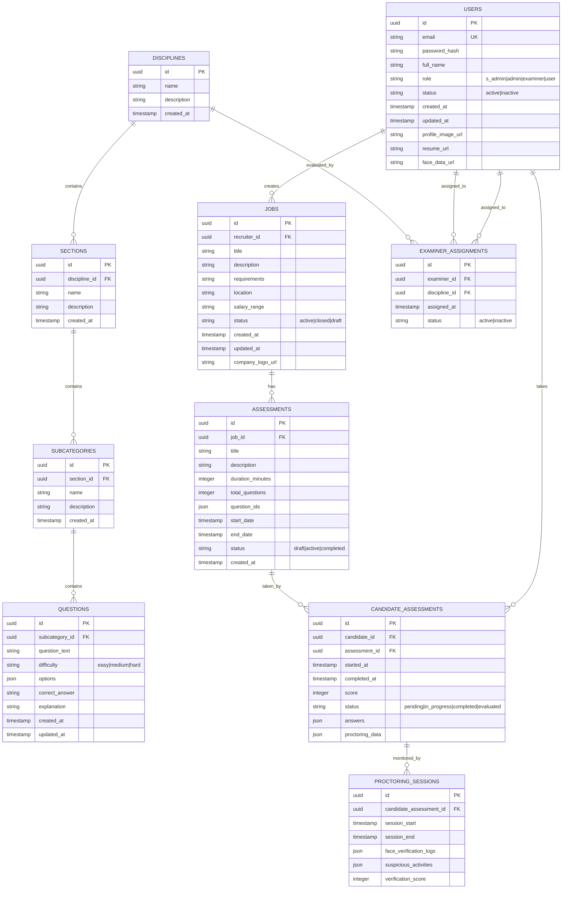
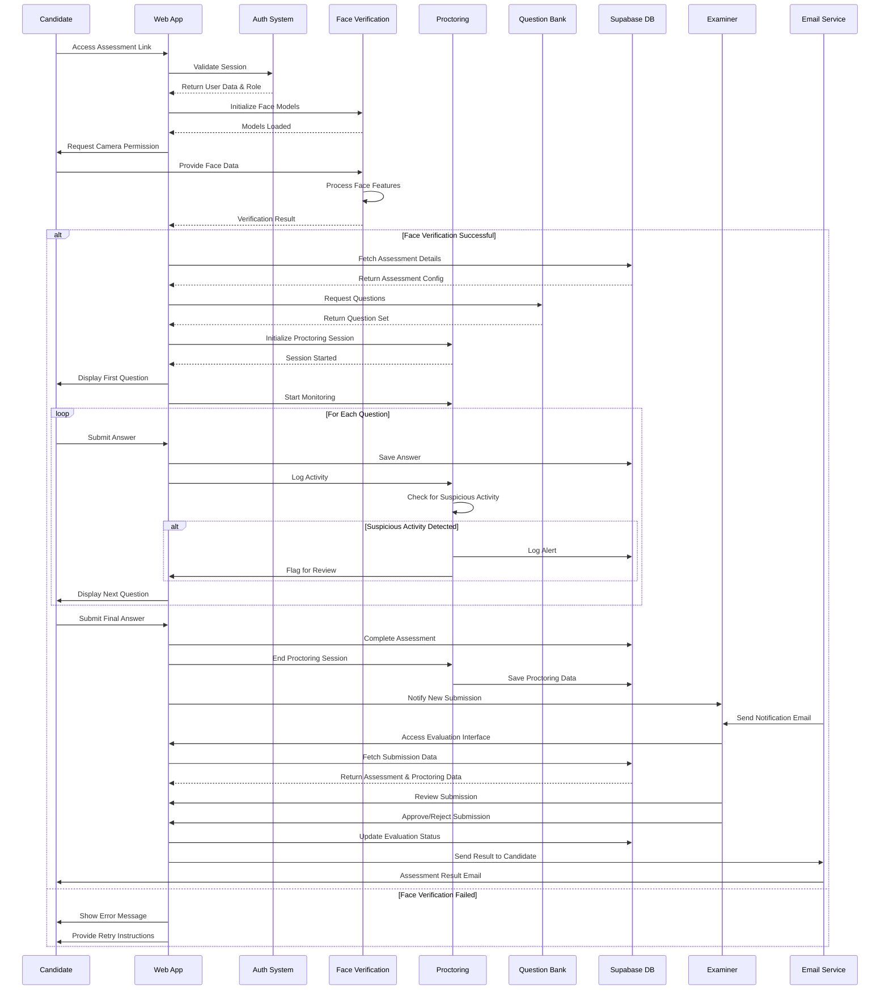

REPUBLIQUE DU CAMEROUN REPUBLIC OF CAMEROUN

---

PAIX-TRAVAIL-PATRIE PEACE-WORK-FATHERLAND

---

MINISTÈRE DE L’EMPLOI ET DE LA FORMATION MINISTRY OF EMPLOYMENT AND
PROFESSIONNELLE VOCATIONAL TRAINING

---

DELEGATION REGIONALE DU LITTORAL LITTORAL REGION DELEGATION

---

SERVICE DE FORMATION ET DE L’ORIENTATION VOCATIONAL TRAINING AND GUIDANCE
PROFESSIONNELLE

ACADEMIC INTERNSHIP REPORT
Internship carried out from March 5 to August 14, 2024, in view of obtaining the Certificat de Qualification Professionnelle (CQP) in Web Development
Option: Full-Stack Web Development

Written and defended by : [Your Full Name]
Under the supervision of :
Academic of: [Academic Supervisor Name]
Professional of : Mr. Amanhui James

TO MY FAMILY…!

| Theme       | AI‑Verified Assessment & Recruitment Platform |
| ----------- | --------------------------------------------- |
| Application | SkillNet                                      |

# ACADEMIC INTERNSHIP REPORT

Internship carried out from March 5, 2024 to August 14, 2024
Option: Full-Stack Web Development

Written and defended by: [Your Name]
Under the supervision of:

- Academic: [Academic Supervisor Name]
- Professional: Mr. Amanhui James

Dedicated to my family.

## FOREWORD / REMERCIEMENTS

Je remercie sincèrement l’équipe d’Instanvi Sarl pour l’accueil, l’accompagnement et la confiance tout au long de mon stage. Ma gratitude va particulièrement à mon encadrant professionnel, M. Amanhui James, pour ses orientations techniques et sa disponibilité. J’exprime également ma reconnaissance à mon encadrant académique [Nom de l’Encadrant Académique] pour ses conseils méthodologiques. Enfin, je remercie ma famille et mes proches pour leur soutien constant, ainsi que mes camarades de promotion pour les échanges fructueux qui ont enrichi cette expérience.

## RESUME (FR)

Ce rapport présente les résultats de mon stage académique réalisé au sein d’Instanvi Sarl du 5 mars au 14 août 2024, dans l’option Développement Web Full‑Stack. L’objectif principal était une immersion professionnelle visant à consolider mes compétences techniques et méthodologiques en participant à la conception, au développement et à l’intégration de fonctionnalités logicielles en conditions réelles. Le travail s’est déroulé dans un cadre agile (sprints, réunions de suivi, revues de code) avec un usage rigoureux de Git/GitHub et de la documentation technique.

Sur le plan technologique, j’ai contribué à des interfaces responsives avec Next.js 14, TypeScript et Tailwind CSS, et j’ai implémenté des services applicatifs reposant sur Supabase (PostgreSQL, Auth, Storage) pour l’authentification, la persistance et la gestion de fichiers. J’ai également exploré des approches de vision par ordinateur (MediaPipe, Face‑API.js) dans le cadre de prototypes de vérification faciale et de supervision d’évaluations. Des outils tels que Docker, Postman, ESLint/Prettier et des tableaux de bord analytiques ont été mobilisés pour assurer la qualité, la performance et la sécurité (RBAC, validation des données).

Les contributions majeures portent sur la mise en place de composants réutilisables, la définition de schémas de données, le développement d’API REST, l’optimisation des temps de chargement et l’amélioration de l’expérience utilisateur. Les résultats obtenus se traduisent par une meilleure maîtrise de l’architecture applicative, des pratiques de tests et d’observabilité, ainsi qu’une autonomie accrue dans la résolution de problèmes.

À l’issue du stage, j’ai capitalisé ces acquis au travers d’un projet personnel intitulé « SkillNet », une plateforme d’évaluation et de recrutement assistée par l’IA avec vérification faciale et supervision automatisée. Ce document présente l’entreprise d’accueil, le déroulement du stage, l’environnement et les choix techniques, la conception fonctionnelle de la plateforme, puis formule des remarques et recommandations.

## ABSTRACT (EN)

This report presents the outcomes of my academic internship at Instanvi Sarl, conducted from March 5 to August 14, 2024, in the Full‑Stack Web Development track. The primary objective was professional immersion to strengthen both technical and methodological skills through the design, development, and integration of production features within an engineering team. The work followed agile practices (sprints, stand‑ups, code reviews), with disciplined use of Git/GitHub and technical documentation.

From a technical perspective, I contributed to responsive interfaces using Next.js 14, TypeScript, and Tailwind CSS, and implemented application services on Supabase (PostgreSQL, Auth, Storage) for authentication, persistence, and file management. I also explored computer‑vision approaches (MediaPipe, Face‑API.js) to prototype face verification and automated supervision for assessments. Tooling such as Docker, Postman, ESLint/Prettier, and analytics dashboards supported quality, performance, and security (RBAC, input validation).

Key contributions include building reusable components, defining data schemas, developing REST APIs, optimizing load times, and improving user experience. The resulting outcomes are stronger mastery of application architecture, testing and observability practices, and increased autonomy in problem solving.

Following the internship, I leveraged these learnings in a personal project named “SkillNet,” an AI‑assisted assessment and recruitment platform featuring face verification and automated proctoring. This document introduces the host company, summarizes the internship activities, details the technical environment and platform design, and concludes with remarks and recommendations.

## KEYWORDS / MOTS-CLÉS

AI‑assisted assessment; Recruitment platform; Biometric face verification; Automated proctoring; Anti‑cheating; Computer vision; Face recognition (MediaPipe, Face‑API.js, TensorFlow.js); On‑device inference; Next.js 14; TypeScript; Tailwind CSS; Supabase (Auth, Storage); PostgreSQL; REST APIs; RBAC; Internationalization (EN/FR); Docker; Git/GitHub; SkillNet (projet personnel)

## TABLE OF CONTENTS

FOREWORD ......................................................................................................................... i
RESUME ............................................................................................................................. ii
ABSTRACT ......................................................................................................................... iii
KEYWORDS ........................................................................................................................ iv
PART I: PRESENTATION OF INSTANVI AND COURSE PROCEDURE
CHAPTER I: PRESENTATION OF INSTANVI SARL ................................................... 1
● Section I: How Instanvi Works ..................................................................................... 2
CHAPTER II: COURSE OF THE INTERNSHIP .................................................................. 3
● Section I: Welcome to the Company ............................................................................. 4
● Section II: Work Carried Out ......................................................................................... 5
● Section III: Beneficial Contributions of the Internship .................................................. 8
PART II: DESIGN AND PRODUCTION OF THE PLATFORM
CHAPTER III: WEBSITE PRESENTATION — SKILLNET (PERSONAL PROJECT) ........... 9
● Section I: Description ................................................................................................... 10
CHAPTER IV: OPERATION AND SYSTEM ENVIRONMENT ........................................ 11
● Section I: Web Interface ............................................................................................... 12
● Section II: Admin Dashboard ....................................................................................... 13
● Section III: Development Environment and Technologies Used .................................. 14
● Section IV: Use Case Diagram ..................................................................................... 15
● Section V: ER Diagram ............................................................................................... 16
● Section VI: Sequence Diagram ..................................................................................... 17
PART III: REVIEWS AND SUGGESTIONS
CHAPTER V: FINAL THOUGHTS AND RECOMMENDATIONS ..................................... 17
● Section I: Remarks ....................................................................................................... 18
● Section II: Suggestions ................................................................................................. 19
CONCLUSION .................................................................................................................... 20

## PART I: PRESENTATION OF INSTANVI AND COURSE PROCEDURE

### CHAPTER I: PRESENTATION OF INSTANVI SARL

In many emerging markets, brands face a fragmented communication landscape: channels are numerous (TV/Radio, newspapers, billboards, events, social media, influencers, display ads), performance data is inconsistent, and targeting options vary widely by outlet. This complexity often leads to guesswork, budget waste, and limited visibility on what truly drives results. Instanvi Sarl, founded by Mr. Amanhui James, was created to address these challenges head‑on by providing a unified market intelligence and multi‑channel communication platform that compares channels, plans coordinated deployments, and optimizes spend continuously based on real‑world performance. In addition to campaign orchestration, Instanvi also engineers custom software for clients—web/mobile applications, analytics dashboards, data pipelines, and API integrations—so that organizations can operationalize their market workflows end‑to‑end. The platform brings together advanced targeting (interests, demographics, geo‑fencing, religion, device type/model, socio‑economic class, ethnicity, custom lists), rigorous brand‑safety verification, and transparent analytics so decisions are evidence‑driven rather than intuition‑based. Beyond orchestration, Instanvi integrates tracking and lead‑harvesting (USSD, short links, QR codes, forms, virtual phone numbers) with one‑click CRM export, ensuring traceability from exposure to conversion. With managed services before, during, and after campaigns, Instanvi equips startups, SMEs, NGOs, agencies, and large enterprises to scale efficiently across traditional and digital media while maintaining control, compliance, and measurable ROI.

#### Section I: How Instanvi Works

##### About Instanvi

Instanvi Sarl is a market intelligence and multi‑channel communication platform that enables businesses of all sizes to find and reach their target audiences at any budget. The platform compares advertisement channels and orchestrates coordinated deployments across traditional and digital media to identify the most efficient exposure mix for each mission. Advanced targeting, spend optimization, brand‑safety controls, and integrated tracking tools ensure transparent, performance‑driven campaigns. Founded by Mr. Amanhui James.

##### Services

- Multi‑channel ad planning and placement (TV & Radio, Social Media, Online Influencers, Billboards, Events, Newspapers, Display/Prospecting)
- Channel comparison with budget optimization and performance insights
- Advanced audience targeting (interests, demographics, geo‑fencing, religion, device type/model, income class, ethnicity, custom user lists)
- Brand safety verification (manual vetting and outlet ratings)
- Spend transparency and performance dashboards
- Managed services (expert guidance before, during and after campaigns)
- Lead capture and CRM export via built‑in tracking tools
- Custom software engineering for clients (web/mobile apps, dashboards, data pipelines, APIs/integrations)

Software Development & Engineering (Build‑for‑Client)

- Product discovery and requirements engineering (workshops, scoping, roadmaps)
- UI/UX design and prototyping (wireframes, design systems, usability)
- Web application development (front‑end/back‑end, APIs, microservices)
- Mobile application development (cross‑platform)
- Systems integration (third‑party APIs, CRM/ERP, payments, messaging)
- Data engineering and analytics (pipelines, dashboards, reporting)
- Quality assurance (manual/automated testing) and security hardening
- DevOps, CI/CD, containerization and cloud deployment
- Maintenance, monitoring and continuous improvement (SLA/Support)

##### Products

- USSD: Interactive lead‑generation apps usable on all devices
- Links: Short, branded links with performance analytics
- QR Codes: Quick‑share codes with online/offline scan tracking
- Giveaway: Pre‑built giveaway campaigns for efficient lead capture
- Forms: No‑code surveys and data collection
- Phone Numbers: Virtual numbers for campaign monitoring

##### Targeting & Data

- Combine multiple criteria: interests, demographics, geo‑fencing, religion, device type/model, socio‑economic class, ethnicity, and custom lists
- Extend beyond standard digital audiences with localized, non‑traditional segments

##### Media Channels

- Traditional: TV & Radio, newspapers, billboards, socio‑cultural gatherings/events
- Digital: Social platforms, online influencers/creators, display/prospecting ads
- Offline↔Online connectors: USSD, QR, short links, virtual phone numbers

##### Optimization, Safety & Operations

- Unparalleled spend optimization to double down on high‑performing channels
- Manual verification for brand safety and organic engagement
- Managed services with rapid support and post‑campaign reviews

##### Contacts

- Email: hello@instanvi.com
- Phone: +237 672 14 13 21
- Address: Douala, Bonaberi, Kwemo Centre
- Website: https://instanvi.com/
- Founder: Mr. Amanhui James

### CHAPTER II: COURSE OF THE INTERNSHIP

#### Section I: Welcome to the Company

## Internship Details

**Internship Duration**: March 5, 2024 - August 14, 2024  
**Department/Team**: Full Stack Development  
**Position**: Full Stack Developer Intern  
**Supervisor**: Mr. Amanhui James  
**Company**: Instanvi Sarl

#### Section II: Work Carried Out

Tasks completed at Instanvi included:
● Islamic Banking: https://islamic-banking.vercel.app  
● Taxlion: https://taxlion.vercel.app  
● Agroforce: https://agroforce-test.vercel.app  
● Potta Finance: https://potta-frontend.vercel.app  
● SkillNet (personal continuation, see Part II): https://skillnet_app.vercel.app

ISLAMIC BANKING:
Islamic Banking is a Sharia‑compliant finance platform with operational dashboards and end‑to‑end financing workflows, including Murabaha, Salam and Ijarah contracts. The dashboard provides segment filters (All/Murabaha/Salam), progress and economic‑sector breakdowns, a date‑range picker, and KPI cards for Total Assets, Liabilities and Customers with trend indicators. Users can capture and review payments via a paginated “Enter Payment” table (date, customer, product, cost, duration, status), while back‑office modules cover Journal and Reports. A configuration area manages Categories, Financing, Assets and Products, alongside general Settings, enabling administrators to adapt product lines and accounting structures as needs evolve. Live: https://islamic-banking.vercel.app  
Repository: https://github.com/BlessedNur/islamic_banking

Key contributions:

- Built the dashboard layout with KPI cards, segment filters and date range controls
- Implemented financing modules (Murabaha/Salam/Ijarah) page flows and shared UI patterns
- Delivered the payments table with sorting, status chips, pagination and inline actions
- Added Journal/Reports navigation, empty/loading/error states and accessible components
- Created configuration CRUD screens for Categories, Assets, Products and Financing
- Enforced RBAC and protected routes; optimized performance and responsiveness

This project strengthened Our expertise in Next.js/TypeScript architecture, data‑driven dashboards, and secure RBAC workflows while expanding domain knowledge of Sharia‑compliant financing (Murabaha/Salam/Ijarah). It also improved my autonomy in scoping tasks, estimating, and meeting sprint deadlines with production‑ready quality.

TAXLION:
Taxlion is a comprehensive digital tax declaration and compliance portal that unifies taxpayer onboarding, profile management, guided multi‑step declarations (income tax, VAT, withholding, penalties and amendments), secure supporting‑document submission, online payments with instant receipts, and end‑to‑end status tracking in a single interface. For administrators, it provides back‑office case intake, triage and assignment, review and approval/rejection workflows, notices and messaging, a compliance calendar with reminders, and auditable activity logs with exportable reports (CSV/PDF). Role‑based access controls separate taxpayer and staff capabilities, while dashboards, filters and advanced search streamline high‑volume processing. The application is optimized for mobile, accessibility and performance to support filings at scale. Live: https://taxlion.vercel.app/

Key contributions:

- Developed multi‑step tax declaration forms with client/server validation and clear error states
- Implemented secure file uploads for supporting documents with metadata and size/type checks
- Built admin dashboards with summaries, sortable tables, filters and pagination
- Added workflow cues (toasts, status chips, step indicators) and email/notification hooks
- Ensured role‑based access for staff vs clients and protected routes
- Improved performance (data fetching patterns, code‑splitting) and mobile accessibility

AGROFORCE:
Agroforce is an agriculture operations and field‑data platform centered on a structured farmer and farm registry. The application organizes organizations into Groups (Branches and Villages), manages Field Staff (Data Collectors and Supervisors), and provides reporting via Area Summary and Map View. From the Farmers module, operators can add individual farmers, bulk onboard via CSV upload, and export registries to CSV for downstream analytics. Additional sections cover Farms, Devices and Users, with Logs offering traceability for changes. The information architecture supports rural deployment needs, role‑separated workflows, and geographic roll‑ups for program reporting. Live (Farmers): https://agroforce-test.vercel.app/farmer

Key contributions:

- Implemented Farmers registry UI with search, filters, pagination, and actions (Add Farmer, Upload/Export CSV)
- Built Group navigation (Branches, Villages) and basic hierarchy browsing to contextualize farmers and farms
- Created Field Staff views for Data Collectors and Supervisors with role‑appropriate actions
- Added Reports entry points (Area Summary, Map View) and integrated data hooks/placeholders for geo insights
- Ensured responsive layouts and accessible components for low‑bandwidth and mobile contexts
- Improved data‑fetching patterns and error/empty/loading states for robust field operations

POTTA FINANCE:
Potta Finance is a financial operations portal that consolidates customer onboarding/KYC, account and transaction management, payments/transfers, expenses tracking, and analytic dashboards into a single interface. It surfaces real‑time summaries and charts for balances, cashflow and activity, while role‑based access governs what staff and customers can view or act on. Users can review transaction histories, drill into details, and export data for reconciliation and reporting. The Expenses area enables recording operational spend with categories, vendors, amounts, dates and notes; supports filtering, date ranges, pagination and CSV export; and may include attachments/receipts for auditability. Administrative areas cover user/role management and settings. Live: https://potta-frontend-git-updatedchanges-devdynasty.vercel.app/

Key contributions:

- Implemented guided onboarding/KYC flows with multi‑step forms, validation and document capture
- Built transaction lists and detail views with filters, pagination and export options
- Delivered Expenses CRUD with category tagging, date/vendor filters, CSV export and receipt attachments
- Added dashboards and visualizations for balances, trends and activity breakdowns
- Enforced RBAC and secure session handling across customer/staff areas
- Improved perceived performance with optimized data‑fetching, caching and code‑splitting
- Hardened UX with consistent loading/empty/error states and mobile‑first responsiveness

SKILLNET (PERSONAL CONTINUATION):
An AI‑assisted assessment and recruitment platform with face verification and automated proctoring. See Part II for detailed design, features, and stack.

## Technical Skills & Learning

During my internship at Instanvi Sarl, I had the opportunity to work with cutting-edge technologies and expand my technical expertise significantly. Here are the key areas where I developed my skills:

### **Frontend Technologies**

- **Next.js 14**: Advanced React framework with App Router for building scalable web applications
- **TypeScript**: Strong typing and enhanced development experience
- **Tailwind CSS**: Utility-first CSS framework for rapid UI development
- **React Hooks**: State management and component lifecycle management
- **Responsive Design**: Creating mobile-first, cross-platform user interfaces

### **Backend & Database**

- **Supabase**: Modern open-source Firebase alternative for backend services
- **PostgreSQL**: Advanced relational database management
- **RESTful APIs**: Designing and implementing API endpoints
- **Authentication Systems**: User management and security implementation
- **File Storage**: Cloud-based file upload and management systems

### **AI & Computer Vision**

- **MediaPipe**: Google's ML framework for real-time media processing
- **TensorFlow.js**: Machine learning in the browser
- **Face-API.js**: Facial recognition and analysis capabilities
- **Computer Vision**: Image processing and analysis techniques

### **Development Tools & Practices**

- **Git & GitHub**: Version control and collaborative development
- **Docker**: Containerization and deployment
- **API Testing**: Postman and similar tools for API validation
- **Code Quality**: ESLint, Prettier for code formatting and standards
- **Agile Methodology**: Sprint planning, daily standups, and iterative development

### **Additional Technologies**

- **UI Libraries**: Radix UI, Material-UI, Headless UI components
- **State Management**: React Context API and custom hooks
- **Internationalization**: Multi-language support with next-intl
- **Charts & Visualization**: ApexCharts, Recharts for data presentation
- **PDF Processing**: React-PDF for document handling
- **Excel Processing**: XLSX library for spreadsheet operations

### **Learning Outcomes**

- **Full Stack Development**: End-to-end application development experience
- **Database Design**: Schema design and optimization
- **API Development**: RESTful API design and implementation
- **Security Best Practices**: Authentication, authorization, and data protection
- **Performance Optimization**: Code splitting, lazy loading, and caching strategies
- **Testing & Debugging**: Comprehensive testing approaches and error handling

## PART II: DESIGN AND PRODUCTION OF THE PLATFORM

### CHAPTER III: WEBSITE PRESENTATION — SKILLNET (PERSONAL PROJECT)

#### Section I: Description

SkillNet is a proctored, multi‑role assessment and recruitment platform that unifies test creation, secure delivery, candidate verification and hiring workflows in a single, cloud‑ready application. Designed for Super Admins, Recruiters, Examiners and Candidates, the platform provides a structured question bank (disciplines → sections → subcategories → difficulty), timed assessments with autosave and resilient resume, and automated scoring aligned to configurable rubrics. To protect integrity, SkillNet performs on‑device face verification and continuous supervision during sessions (presence, identity consistency, multi‑face detection, camera tamper signals), minimizing server load while improving privacy. Dashboards expose real‑time metrics for participation, performance by discipline/section, proctoring alerts and hiring funnels; recruiters manage jobs, applications and shortlists, while candidates complete profiles, register face data and sit for assessments in their locale (EN/FR). File storage supports resumes and logos, and internationalization, accessibility and mobile responsiveness ensure broad usability. The system emphasizes security (RBAC, input validation, audit trails) and data protection (least‑privilege, signed URLs), making it suitable for high‑stakes evaluations and data‑sensitive hiring.

## Project Information

**Personal Project**: SkillNet (Post-Internship)  
**Project Type**: Full-Stack Web Application  
**Development Period**: Post-internship (2024 – present) [update exact dates if needed]  
**Role**: Independent Developer  
**Context**: SkillNet was developed after my internship at Instanvi Sarl, applying the technologies and practices I learned. It is not an Instanvi company project or deliverable.

### **Project Overview**

SkillNet is a comprehensive talent assessment and recruitment management platform designed to streamline the hiring process through advanced technology integration. The platform combines modern web development practices with cutting-edge AI and computer vision capabilities to create a robust solution for recruiters, candidates, and administrators.

### **Project Description**

SkillNet serves as an intelligent recruitment platform that helps companies identify, assess, and hire the best talent through:

- **Multi-Role User Management**: Super Admin, Recruiter, Candidate, and Examiner roles with distinct permissions and functionalities
- **Advanced Assessment System**: Multi-disciplinary question banks with customizable sections, subcategories, and difficulty levels
- **AI-Powered Face Recognition**: Real-time facial verification for candidate identity validation and anti-cheating measures
- **Automated Test Supervision**: Computer vision-based monitoring during assessments to ensure test integrity
- **Comprehensive Job Management**: Job posting, application tracking, and candidate evaluation workflows
- **Analytics Dashboard**: Real-time insights into recruitment metrics, candidate performance, and system usage

### **Technology Stack Used**

- **Frontend**: Next.js 14, TypeScript, Tailwind CSS, React
- **Backend**: Supabase (PostgreSQL, Authentication, Storage)
- **AI/ML**: MediaPipe, TensorFlow.js, Face-API.js
- **UI Components**: Radix UI, Material-UI, Headless UI
- **State Management**: React Context, React Hook Form
- **Internationalization**: Multi-language support (English/French)
- **Deployment**: Docker, Docker Compose
- **Version Control**: Git, GitHub

### **Key Features Developed**

1. **User Authentication & Authorization System**
2. **Responsive Dashboard Interfaces**
3. **Question Bank Management System**
4. **Real-time Face Recognition Integration**
5. **Assessment Creation & Management**
6. **Candidate Evaluation & Scoring**
7. **Job Posting & Application Tracking**
8. **Multi-language Support**
9. **File Upload & Management**
10. **Advanced Filtering & Search Capabilities**

### **Project Impact**

SkillNet represents a significant advancement in recruitment technology, combining traditional assessment methods with modern AI capabilities. The platform addresses key challenges in remote hiring, candidate verification, and assessment integrity while providing an intuitive user experience for all stakeholders in the recruitment process.

### CHAPTER IV: OPERATION AND SYSTEM ENVIRONMENT

#### Section I: Web Interface

##### 1. Functional Specifications

The SkillNet platform implements a comprehensive role-based access control system that ensures secure and efficient operation across different user types. The system is designed to provide specific capabilities and permissions based on user roles, maintaining data integrity and operational security.

**Main Actors:**

- **Super Admin**: Full system access for question management, examiner administration, and system configuration
- **Recruiter**: Job posting, candidate management, and application review capabilities
- **Examiner**: Assessment review and submission evaluation based on assigned disciplines
- **Candidate**: Assessment participation, face registration, and application management

**Authentication & Authorization:**

The platform employs a robust authentication system that ensures secure access and proper authorization for all users. The system includes:

- Secure email/password authentication with role-based access control (RBAC)
- Protected routes with role-specific guards (s_admin, admin, examiner, user)
- Session management with encrypted profile storage
- Multi-language support (English/French) with locale-aware routing

**Role-Specific Capabilities:**

Each user role is granted specific permissions and access levels to maintain system security and operational efficiency. The platform implements a hierarchical permission system that ensures users can only access features relevant to their responsibilities while maintaining data integrity and security protocols.

**Super Admin (s_admin):**

The Super Admin role represents the highest level of system access and control within the SkillNet platform. This role is responsible for overseeing the entire platform's operation, managing core system components, and ensuring proper configuration of all assessment and recruitment workflows.

- Access to question bank management (QuizQuetions page)
- Create, edit, and manage questions, sections, and subcategories
- Examiner account management (add, edit, disable/enable)
- System configuration and organization settings
- Full dashboard access with comprehensive analytics

**Recruiter (admin):**

The Recruiter role is designed for human resources professionals and hiring managers who need to manage the complete recruitment lifecycle. This role focuses on job posting, candidate management, and the overall hiring process while maintaining appropriate access controls.

- Job posting creation, editing, and management
- Candidate application review and shortlisting
- Assessment invitation and pipeline management
- Export functionality for reports and data analysis

**Examiner:**

The Examiner role is specifically designed for subject matter experts and evaluators who review candidate submissions and ensure assessment integrity. This role provides focused access to evaluation tools while maintaining strict boundaries around system administration functions.

- Review candidate test submissions and monitoring photos
- Approve or reject submissions based on assigned disciplines
- View assigned tests filtered by expertise areas
- Access to evaluation_check interface only

**Candidate (user):**

The Candidate role represents end-users who participate in assessments and apply for positions through the platform. This role provides essential functionality for assessment participation while maintaining security and privacy standards.

- Account registration and profile completion
- Face registration using device camera
- Assessment participation with real-time proctoring
- Application management and status tracking

##### 2. Use Cases

Use case diagrams represent the core functions and scope of the SkillNet system. They highlight interactions between the system and its actors, with a focus on how different user roles interact with the platform's features.

**Primary Use Cases:**

- User authentication and role-based access
- Face verification and registration
- Assessment creation and management
- Real-time proctoring and monitoring
- Job posting and application processing
- Question bank administration
- Examiner assignment and review workflows

##### 3. Class Diagram

Class diagrams are an essential part of UML modeling, used to represent the static structure of the SkillNet system. The class diagram outlines the main classes (User, Question, Assessment, Job, Application, Examiner), their attributes (such as name, email, role, status), methods (such as create, update, delete, verify), and relationships between them. This helps clarify how data is organized and how the system components interact.

**Key Classes:**

- **User**: Base class for all users with authentication and profile data
- **Question**: Assessment questions with discipline, subcategory, and difficulty attributes
- **Assessment**: Test sessions with timing, proctoring settings, and question assignments
- **Job**: Employment opportunities with requirements and application workflows
- **Application**: Candidate submissions with status tracking and evaluation data
- **Examiner**: Specialized user class with discipline assignments and review capabilities

##### 4. Operational Process

The SkillNet platform is designed to provide a comprehensive assessment and recruitment workflow with automated proctoring and face verification. The operational workflow is as follows:

1. **User Registration & Onboarding:**

   - Users register with email/password
   - Complete profile information and upload resume
   - Register face data using device camera
   - Role assignment and access provisioning

2. **Assessment Creation (Super Admin):**

   - Create questions and organize by discipline/section/subcategory (e.g., Programming → JavaScript → ES6 Features → Advanced)
   - Build assessments with timing and proctoring settings (e.g., 60-minute test with face verification every 30 seconds)
   - Assign examiners based on discipline expertise (e.g., Dr. Smith for Computer Science, Prof. Johnson for Mathematics)
   - Configure face verification thresholds (e.g., 85% similarity match required for identity verification)

3. **Job Management (Recruiter):**

   - Create and publish job postings
   - Invite candidates to assessments
   - Review applications and shortlist candidates
   - Track hiring pipeline progress

4. **Assessment Execution (Candidate):**

   - Receive assessment invitations
   - Complete face verification before starting
   - Take assessment with continuous proctoring
   - Submit answers with autosave functionality

5. **Evaluation & Review (Examiner):**

   - Review submitted assessments and proctoring data
   - Approve legitimate submissions
   - Flag suspicious activities for further review
   - Provide feedback and scoring

This process ensures secure, efficient, and transparent assessment and recruitment workflows while maintaining data integrity and user privacy.

#### Section II: Admin Dashboard

##### 1. Dashboard Overview

The main dashboard provides different sections with the most important and urgent information for system operators. This is the central section where administrators perform various actions and monitor system health.

**KPI Cards Display:**

- Active job postings count
- Scheduled assessments for the day
- Total submissions received
- Face verification success rate
- Proctoring alerts requiring attention

**Real-time Metrics:**

- User registration trends
- Assessment completion rates
- System performance indicators
- Security alerts and notifications

##### 2. Data Management

The data management section provides comprehensive tools for managing users, content, and recruitment processes. This area ensures efficient organization and control over all system data.

**User Management:**

- Add new examiners with discipline assignments
- Edit or delete existing user accounts
- Manage user roles and permissions
- Monitor user activity and login history

**Content Management:**

- Question bank administration
- Section and subcategory organization
- Assessment configuration and scheduling
- File storage and media management

**Recruitment Pipeline:**

- Job posting lifecycle management
- Application status tracking
- Candidate communication tools
- Interview scheduling and coordination

##### 3. Assessment Management

The assessment management section provides tools for creating, configuring, and monitoring assessments. This area ensures proper test administration and evaluation processes.

**Question Bank:**

- Create and edit questions with multiple choice options
- Organize questions by discipline, section, and subcategory
- Import/export question sets
- Manage question difficulty levels and timing

**Proctoring Configuration:**

- Set face verification thresholds
- Configure monitoring parameters
- Define alert conditions and escalation rules
- Review proctoring session logs

**Reporting & Analytics:**

- Generate assessment performance reports
- Export data in various formats (CSV, PDF)
- View analytics dashboards
- Track system usage and trends

#### Section III: Development Environment and Technologies Used

The SkillNet platform is built using modern web development technologies and best practices. The technology stack is carefully chosen to ensure scalability, security, and performance while providing a robust foundation for the platform's features.

**Frontend Technologies:**

1. **Next.js 14** – React-based framework with App Router for building scalable web applications
2. **TypeScript** – Strongly typed programming language for enhanced development experience
3. **Tailwind CSS** – Utility-first CSS framework for rapid UI development
4. **React Hooks** – State management and component lifecycle management
5. **Radix UI/shadcn** – Accessible component library for consistent UI patterns

**Backend & Database:**

1. **Supabase** – Modern open-source Firebase alternative providing authentication, database, and storage
2. **PostgreSQL** – Advanced relational database for data persistence and relationships
3. **RESTful APIs** – Custom API routes for business logic and data operations
4. **Authentication** – Role-based access control with encrypted session management
5. **File Storage** – Cloud-based file upload and management with signed URLs

**AI & Computer Vision:**

1. **MediaPipe** – Google's ML framework for real-time face detection and analysis
2. **Face-API.js** – Facial recognition and landmark detection capabilities
3. **TensorFlow.js** – Machine learning models for on-device inference
4. **Computer Vision** – Image processing and analysis for proctoring features

**Development Tools & Services:**

- **Git & GitHub** – Version control and collaborative development
- **Docker & Docker Compose** – Containerization for consistent deployment
- **Postman** – API testing and documentation
- **ESLint/Prettier** – Code quality and formatting standards
- **next-intl** – Internationalization for multi-language support

**Additional Libraries:**

- **React Hook Form** – Form state management and validation
- **ApexCharts/Recharts** – Data visualization and analytics
- **react-pdf** – PDF generation and viewing capabilities
- **xlsx** – Excel file processing and export functionality
- **moment.js** – Date and time manipulation utilities

#### Section IV: Use Case Diagram

```mermaid
graph TD
    %% Actors
    SA[Super Admin]
    REC[Recruiter]
    EX[Examiner]
    CAN[Candidate]

    %% System Boundary
    subgraph "SkillNet Platform"
        %% Core System Components
        AUTH[Authentication System]
        QB[Question Bank Management]
        JM[Job Management]
        AM[Assessment Management]
        EV[Evaluation System]
        FR[Face Recognition]
        PC[Proctoring System]
        DB[(Database)]
        ST[File Storage]

        %% Use Cases
        UC1[Manage Users & Roles]
        UC2[Create/Edit Questions]
        UC3[Organize Question Bank]
        UC4[Post Job Opportunities]
        UC5[Review Applications]
        UC6[Invite Candidates]
        UC7[Review Submissions]
        UC8[Evaluate Assessments]
        UC9[Register Face Data]
        UC10[Take Assessments]
        UC11[Track Progress]
        UC12[Generate Reports]
        UC13[Configure Proctoring]
        UC14[Monitor Sessions]
    end

    %% Actor to Use Case Relationships
    SA --> UC1
    SA --> UC2
    SA --> UC3
    SA --> UC13
    SA --> UC12

    REC --> UC4
    REC --> UC5
    REC --> UC6
    REC --> UC11
    REC --> UC12

    EX --> UC7
    EX --> UC8
    EX --> UC12

    CAN --> UC9
    CAN --> UC10
    CAN --> UC11

    %% System Component Relationships
    UC1 --> AUTH
    UC2 --> QB
    UC3 --> QB
    UC4 --> JM
    UC5 --> JM
    UC6 --> AM
    UC7 --> EV
    UC8 --> EV
    UC9 --> FR
    UC10 --> AM
    UC10 --> PC
    UC11 --> DB
    UC12 --> DB
    UC13 --> PC
    UC14 --> PC

    %% Data Storage
    QB --> DB
    JM --> DB
    AM --> DB
    EV --> DB
    FR --> ST
    PC --> DB

    %% Styling
    classDef actor fill:#e1f5fe,stroke:#01579b,stroke-width:2px
    classDef system fill:#f3e5f5,stroke:#4a148c,stroke-width:2px
    classDef useCase fill:#e8f5e8,stroke:#1b5e20,stroke-width:1px
    classDef storage fill:#fff3e0,stroke:#e65100,stroke-width:2px

    class SA,REC,EX,CAN actor
    class AUTH,QB,JM,AM,EV,FR,PC system
    class UC1,UC2,UC3,UC4,UC5,UC6,UC7,UC8,UC9,UC10,UC11,UC12,UC13,UC14 useCase
    class DB,ST storage
```

#### Section V: ER Diagram (Entity Relationship)

#### Section VI: Sequence Diagram (Assessment Workflow)

## PART III: REVIEWS AND SUGGESTIONS

### CHAPTER V: FINAL THOUGHTS AND RECOMMENDATIONS

#### Section I: Remarks

- Opportunity to contribute to multiple codebases and features
- Mentorship and technical guidance from engineers
- Exposure to real-world agile processes and code reviews
- Noted constraints: intermittent internet and limited equipment at times

#### Section II: Suggestions

- Improve connectivity and developer workstation setup
- Establish weekly review meetings for performance and planning
- Maintain stable design assets/specs to streamline delivery

## Conclusion

My internship at Instanvi Sarl has been an invaluable experience that has significantly enhanced my technical skills and professional development. Working as a Full Stack Developer Intern has provided me with hands-on experience in modern web development technologies, database management, and software architecture. The mentorship from Mr. Amanhui James and the collaborative environment at Instanvi have been instrumental in my growth as a developer.

I am grateful for the opportunity to work on meaningful projects and contribute to the company's mission of helping customers build innovative software solutions. This experience has prepared me well for future challenges in software development and has given me a solid foundation for my career in technology.

---

**Intern**: [Your Name]  
**Supervisor**: Mr. Amanhui James  
**Company**: Instanvi Sarl  
**Duration**: March 5, 2024 - August 14, 2024
